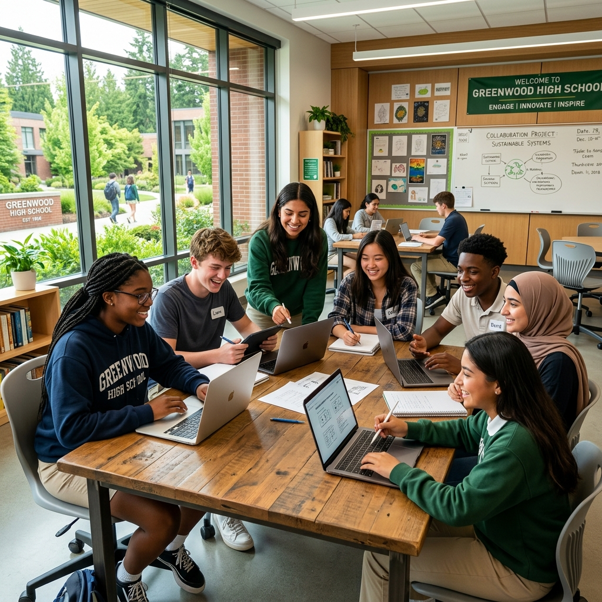

# 🏫 Greenwood High School | Excellence in Education

A modern, high-performance, and visually stunning educational website built with **Next.js 15+**, **Tailwind CSS v4**, and **Framer Motion**. This project showcases academic excellence through a premium digital experience.



## ✨ Key Features

- **🚀 Performance First**: Built with Next.js App Router for optimal speed and SEO.
- **🎨 Modern Design**: Implements a "Glassmorphism" aesthetic with vibrant colors and premium typography.
- **📱 Fully Responsive**: Carefully crafted to look perfect on everything from mobile phones to large 4K displays.
- **🎭 Smooth Animations**: Utilizes Framer Motion for subtle micro-interactions and scroll-triggered animations.
- **🖼️ Interactive Gallery**: A modern image grid with a custom lightbox experience.
- **👤 Faculty Showcase**: Professional cards featuring the dedicated mentors at Greenwood High.
- **📩 Contact System**: Integrated contact form with real-time validation and submission states.

## 🛠️ Technology Stack

- **Core**: [Next.js 15+](https://nextjs.org/) (App Router, TypeScript)
- **Styling**: [Tailwind CSS v4](https://tailwindcss.com/)
- **Animations**: [Framer Motion](https://www.framer.com/motion/)
- **Icons**: [Lucide React](https://lucide.dev/) & [React Icons](https://react-icons.github.io/react-icons/)
- **Fonts**: [Google Fonts](https://fonts.google.com/) (Outfit & Inter)

## 🏁 Getting Started

### Prerequisites

- Node.js 18.17.0 or later
- npm or yarn

### Installation

1. Clone the repository:

   ```bash
   git clone https://github.com/your-username/classical-school-website.git
   ```

2. Install dependencies:

   ```bash
   npm install
   ```

3. Run the development server:

   ```bash
   npm run dev
   ```

4. Open [http://localhost:3000](http://localhost:3000) in your browser.

## 📁 Project Structure

```text
src/
├── app/              # App router (Layout, Page, Globals)
├── components/       # Modular UI components (Navbar, Hero, etc.)
└── public/           # Static assets (Images, SVGs)
    └── images/       # High-quality campus and faculty photos
```

## 🎨 Design Principles

- **Primary Color**: `#2c5530` (Forest Green - Symbolizing Growth & Stability)
- **Accent Color**: `#ffd700` (Gold - Symbolizing Excellence & Achievement)
- **Typography**: `Outfit` for headings and `Inter` for body text to ensure readability and a premium feel.
- **Shadows & Blurs**: Custom `shadow-premium` and `backdrop-blur-xl` for depth and modern feel.

## 📄 License

This project is licensed under the MIT License.

## 📧 Contact

**Greenwood High School Admissions Office**
📍 123 Education Drive, Greenwood, CA 90210
📞 (555) 123-4567
✉️ info@greenwoodhigh.edu

---

Built with ❤️ by Rihad Jahan Opu
